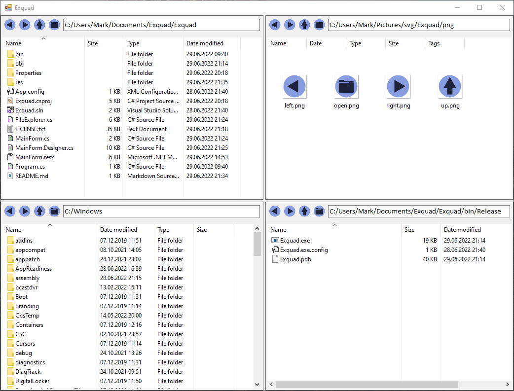

# Exquad (Explorer Quad)

This program is a four-window file explorer made with Windows Forms and C#.

# Images

Images located in [`res`](./res) folder are licensed under a [Creative Commons Attribution-ShareAlike 4.0 International License](https://creativecommons.org/licenses/by-sa/4.0/).